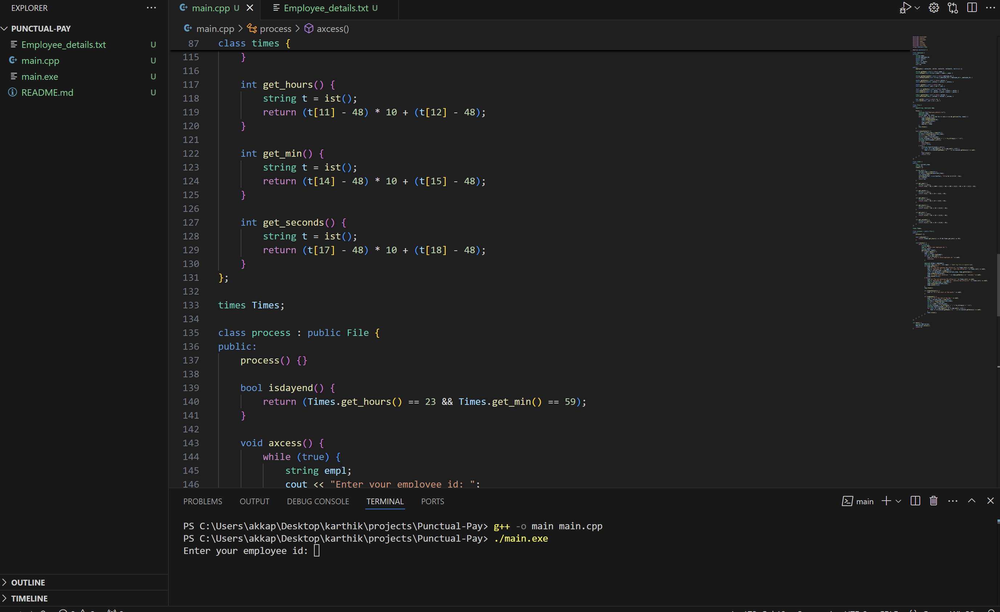
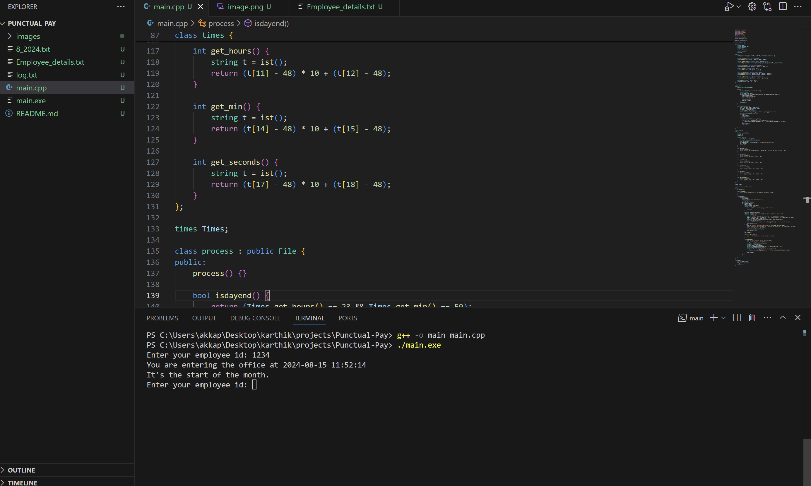
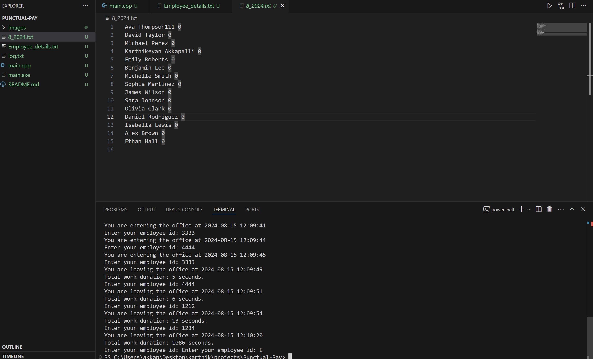
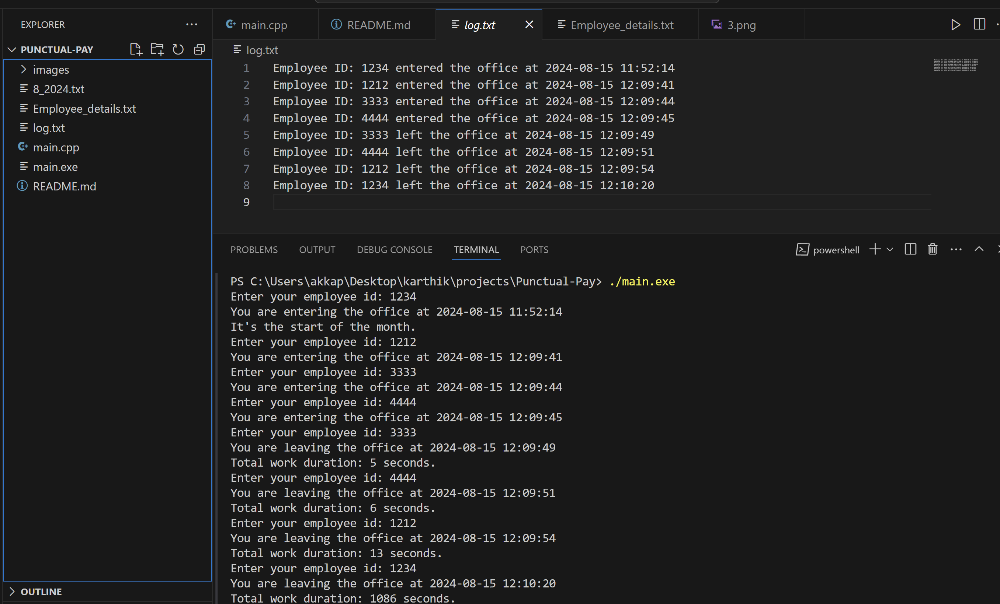

# Payroll-Manager
This project is designed to track employee presence during office hours and calculate salaries based on the time spent in the office. The system automatically logs employee check-ins and check-outs, processes the data, and manages monthly reports.

<h3>Features</h3>
<ul>
    <li><b>Automatic File Creation:</b> At the beginning of each month, the system automatically creates a file named in the format monthnumber_year.txt (e.g., 3_2024.txt). This file stores the total work time and salary details for each employee.</li>
    <li><b>Employee Check-In/Check-Out:</b> Employees can check in and out using their employee ID. In a real-world scenario, this could be integrated with biometric systems such as fingerprint scanners or card readers.</li>
    <li></b>Real-Time Logging:</b> Every check-in and check-out is logged in real-time, calculating the total work duration. The system updates the employee's record with the time spent in the office.</li>
    <li><b>Daily Salary Calculation:</b> At the end of each workday, the system calculates the total salary based on the time worked. It only pays for up to 8 hours, even if an employee works overtime.</li>
</ul>

<h3>Workflow</h3>
<ol type="1">
<li><b>Check-In:</b> Upon entering the office, employees enter their employee ID. The system logs the check-in time.
</li>
<li><b>Check-Out:</b> When leaving the office, employees again enter their ID. The system logs the check-out time, calculates the work duration, and updates their total work time for the day.</li>
<li><b>Monthly Report:</b> If the system detects that no check-ins have been recorded for the month, it creates a new file to start logging for the current month. The file is automatically created on the first check-in of the month.
</li>
<li><b>End of Day Processing:</b> At the end of each day, the system writes the total work duration and calculated salary to the monthly file.</li>
</ol>

<h3>Example Screenshots</h3>
<ul>
     
    <li><b>Environment: </b>The project running environment.
    </li> 
     
    <li><b>Start of Month:</b> When an employee checks in on March 14th, the system recognizes that no employee has checked in yet for the month, indicating the start of the month and creating a new file.</li> 
     
    <li><b>Work Duration:</b> After every logout, the system displays the total time worked, allowing employees to monitor how much time they have left to work for the day. Even if more than 8 hours are worked, only 8 hours will be compensated.
    </li> 
     
    <li><b>Log file: </b> Log file helpful for the keep track empployee Behaviour and Useful when the ERP is crashed.
    </li> 
</ul>

<h2>Future Enhancements<h2>
<b>Graphical User Interface (GUI):</b> The project can be extended by creating a GUI using a toolkit like GTK or Qt.
